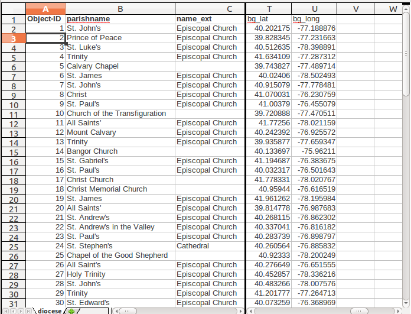

# Central-PA-Church-Map
 Back in the dark days of web mapping (c.2009) I was in school at Penn State and was interested in volunteering to do some work and I was notified through the school that someone at the the [Episcopal Diocese of Central PA](http://www.diocesecpa.org/) wanted to have a web map of all their church locations. It was so that people who are visiting central PA and are of the Episcopal faith could have a place to worship when they are out of town. 

 I worked with the web developer there and we started out with a basic image of a map of Central PA

 One of the first things I did was geo-reference the image in [ArcGIS](http://www.esri.com) so that it lined up against existing real world data. Once the image was geocoded, I put a highway layer and a layer of cities (filtered by population so only major ones showed up) on top so that viewers could get a good reference to where the churches were located.

Once that was completed, the map looked as follows: 

  

 The difficult part was synthesizing the Episcopal diocese data. They had an Excel sheet with the name and location of each diocese. After the dataset was cleaned and ordered, it looked something like this:

 The next step was to turn the addresses into lat/lon values for mapping. I used [ batchgeo.com ](http://batchgeo.com/) to upload the address spreadsheet and return the latlon values into a CSV file which I could then add to my spreadsheet as two new columns:

Once I had those new columns to my spreadsheet, I could associate the Lat/Lon values with the Church Locations using ArcGIS and then plot the churches. I cut down the size of the map to just Central PA and made sure to make the church location icons relevant. It was also decided that the interstates were well known enough that the big labels would just be clutter on the map.

 I also added clickable links at each church location. I used Microsoft Expression Web 2 to create the clickable locations. If a church had a website the church's cross icon went to that website. If we had no website but an email for the church, then the clickable cross linked to the email. Finally if we didn't have either a website or an email, the clickable link went to a google map location of the church. If you moused over a parish icon, a tooltip will pop up with the name of a parish and it's address.

Try it out here: [Web Map](testwebmap/default.html)
